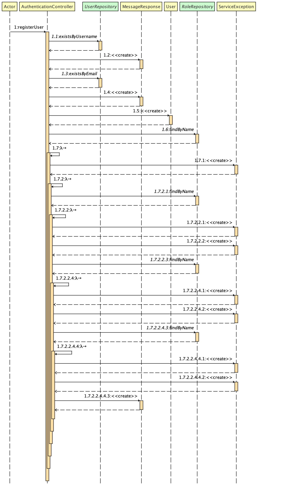
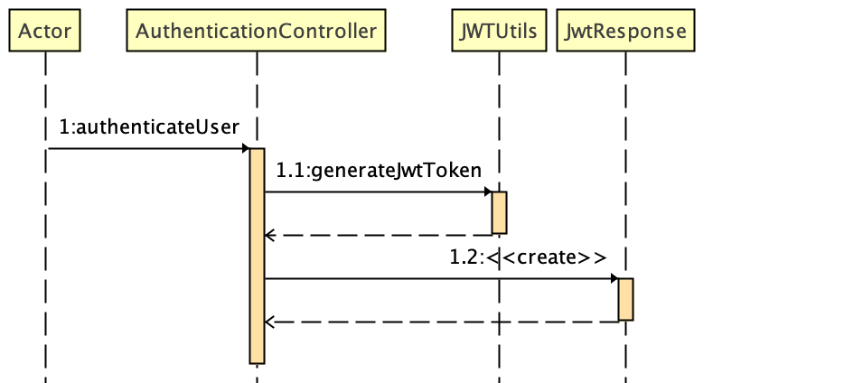

## Springboot JWT Authentication Example

Sample Springboot Based Authentication Application leveraging SpringSecurity

#### Pre-requiste : In order to Sign the JWT Generated and Decoding

**Create Public and Private Keys**

**_Create PrivateKey and Public Cert for 10 years_** 

```openssl req -newkey rsa:2048 -x509 -keyout cakey.pem -out cacert.pem -days 3650 ```


**Add the Key and Certificate in a JKS**
* Step 1 : create PKCS12 using keys generated , -name is alias for private key

```openssl pkcs12 -export -in cacert.pem -inkey cakey.pem -out identity-new.p12 -name "mykey" ```


* Step 2 : Import PKCS12 to JKS

keytool -importkeystore -destkeystore identity.jks -deststorepass password -srckeystore identity.p12 -srcstoretype PKCS12 -srcstorepass password

* Step 3 : Create a Truststore with Public key

```keytool -import -file cacert.pem -keystore trust.jks -storepass password```

###Authentication Controller Sequence Flows

* Register User Flow


* Authenticate User Flow



